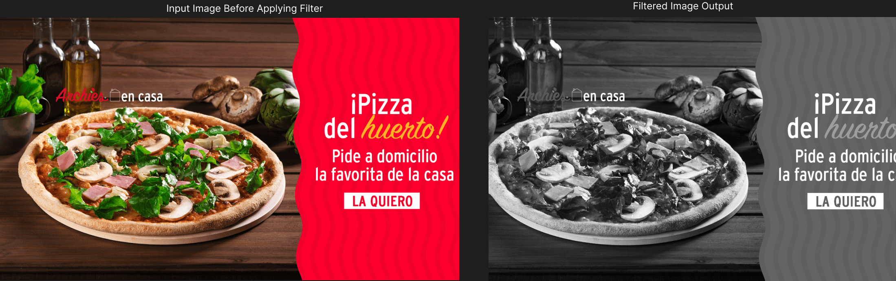

# Image Apply Filter

Inspired by Instagram's "Inkwell" filter, this app simplifies image processing and serves as a foundation for future filter expansions.

# Description

Image Apply Filter App is a lightweight Node.js application that extracts images from zip files, applies a grayscale filter and saves the modified images without relying on third-party image processing libraries (like `sharp`). Instead, it uses PNGJS library for pixel-level manipulation for efficient approach to image filtering.

# Features
- Zip file extraction using yauzl-promise library
- Grayscale filter application using PNGJS library
- Image processing and saving
- Modular code structure
- Asynchronous programming and streams

# Challenge Solved
The app addresses the challenge of efficiently processing multiple images, applying filters and saving the results without introducing dependencies on heavy-duty image processing libraries.

# Use Case
- Apply consistent filters to collections of images.
- Process images for uniform branding.
- Benefit from reduced dependencies, lightweight processing and customizable filtering logic

# Run Application
Prerequisites
- Node.js installed
- `yauzl-promise` and `PNGJS` libraries installed (via npm or yarn)

Steps

- Clone the repository.
- `npm install` or `yarn install`.
- Place the zip file containing images in the project directory.
- Run the app: `node main.js`.
- Extracted and filtered images will be saved in `unzipped` directory.

# Links
Algorithms to Use for Converting to Grayscale:
https://tannerhelland.com/2011/10/01/grayscale-image-algorithm-vb6.html