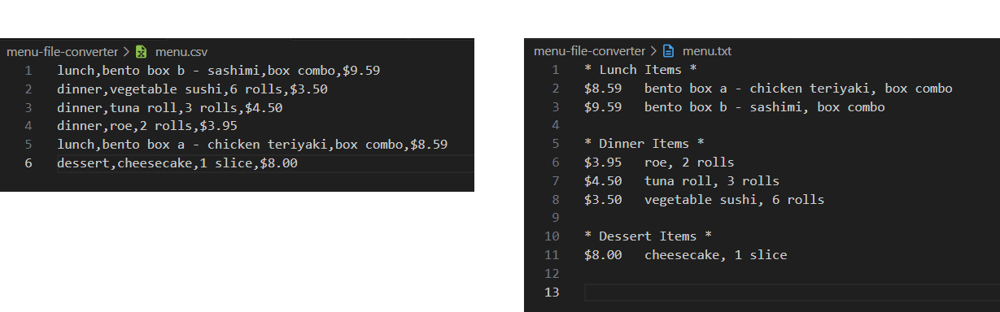

# Menu File Converter 

This app simplifies menu management by automating the conversion of CSV data into a well-formatted TXT file, saving time and reducing errors when organizing menu items.



# Description

Menu File Converter is a lightweight Node.js application designed to seamlessly convert restaurant menu data from CSV format into a clean and organized TXT file.

Using asynchronous programming with `promises` and `async/await`, it efficiently handles file operations. Menu File Converter categorizes items, sorts them alphabetically and formats prices, allowing restaurants or businesses to easily generate and display their menu data in an elegant text format.

# Features

- **CSV to TXT Conversion**: Effortlessly reads a CSV file containing menu data and converts it into a well-structured TXT file.

- **Dynamic Category Handling:** Automatically detects and categorizes meal types like Lunch, Dinner, Dessert and more, with no fixed limitations on categories.

- **Alphabetical Sorting:** Menu items within each category are sorted alphabetically for a neat and professional presentation.

- **Customizable Menus:** Works with any CSV input format following the structure of `meal type`, `meal name`, `quantity` and `price`, allowing flexibility in defining your own categories.

- **Asynchronous File Handling:** Built with Node.js asynchronous features, ensuring fast and non-blocking operations.

- **Elegant Output:** The generated TXT file is structured with sections for each meal type, making it visually clear and easy to understand.
Ideal for restaurant owners, Menu File Converter simplifies menu management and allows businesses to quickly generate and modify their menu in a simple text file format.

# Challenge Solved

This app addresses the challenge of managing and formatting menu data efficiently. 

Restaurants often have to maintain their menus in different formats (CSV, online, printed) and ensure consistency across all versions. Manually converting CSV data into a structured, readable text format can be time-consuming and prone to errors. Furthermore, organizing items by category, sorting them, and ensuring prices are properly formatted can be difficult without automation.

# How it Can Be Used

- **Restaurant Menu Management:** Restaurants can use the program to quickly generate well-organized, formatted TXT menus from CSV files, ensuring their menus are up-to-date across different platforms.

- **Automating Menu Updates:** Whenever there are changes in pricing or menu items, businesses can simply update the CSV file and let the app handle the conversion to a neatly structured text file.

- **Exporting for Print or Web:** The formatted TXT file can be easily shared or printed for use in websites, flyers or other marketing materials.

- **Quick Data Formatting:** It helps anyone who needs to convert and format tabular data (like menus) into a more readable format without manual work.

This tool streamlines the process, ensuring menus are always clear, consistent, and ready to use.

# Run Application

Execute the program to convert the CSV file to a TXT file:

```Bash
node app.js
```

The app will read the `menu.csv file`, convert it to a well-structured `menu.txt` file, and either append new data or create the file if it doesn't exist.

Feel free to add more categories to the `menu.csv` file (ex, Dessert, Drinks, Appetizers, etc.) following the format: `meal type`, `meal name`, `quantity` and `price`.